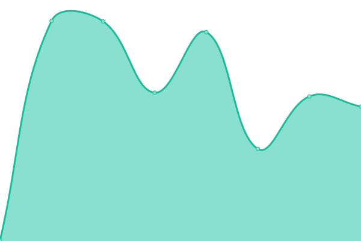
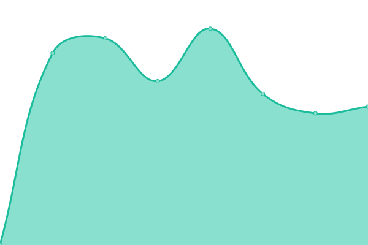

# [📈 Live Status](https://status.ekyo.app): <!--live status--> **🟩 All systems operational**

This repository contains the open-source uptime monitor and status page for [Upptime](https://upptime.js.org), powered by [Upptime](https://github.com/upptime/upptime).

With [Upptime](https://upptime.js.org), you can get your own unlimited and free uptime monitor and status page, powered entirely by a GitHub repository. We use [Issues](https://github.com/upptime/upptime/issues) as incident reports, [Actions](https://github.com/impakt-io/upptime/actions) as uptime monitors, and [Pages](https://status.ekyo.app) for the status page.

<!--start: status pages-->
<!-- This summary is generated by Upptime (https://github.com/upptime/upptime) -->
<!-- Do not edit this manually, your changes will be overwritten -->
<!-- prettier-ignore -->
| URL | Status | History | Response Time | Uptime |
| --- | ------ | ------- | ------------- | ------ |
|  [Ekyo Mesure](https://mesure.ekyo.app) | 🟩 Up | [ekyo-mesure.yml](https://github.com/impakt-io/upptime/commits/HEAD/history/ekyo-mesure.yml) | 

 206ms
     
 | 

<a href="https://status.ekyo.app/history/ekyo-mesure">100.00%</a>
    

|  [Ekyo Trajectoire & Plan d'Action](https://actions.ekyo.app) | 🟩 Up | [ekyo-trajectoire-and-plan-d-action.yml](https://github.com/impakt-io/upptime/commits/HEAD/history/ekyo-trajectoire-and-plan-d-action.yml) | 

 191ms
     
 | 

<a href="https://status.ekyo.app/history/ekyo-trajectoire-and-plan-d-action">100.00%</a>
    

|  [Ekyo Studio](https://studio.ekyo.app) | 🟩 Up | [ekyo-studio.yml](https://github.com/impakt-io/upptime/commits/HEAD/history/ekyo-studio.yml) | 

 196ms
     
 | 

<a href="https://status.ekyo.app/history/ekyo-studio">100.00%</a>
    

|  [Web Ekyo](https://www.ekyo.app) | 🟩 Up | [web-ekyo.yml](https://github.com/impakt-io/upptime/commits/HEAD/history/web-ekyo.yml) | 

 183ms
     
 | 

<a href="https://status.ekyo.app/history/web-ekyo">100.00%</a>
    

<!--end: status pages-->

[**Visit our status website →**](https://status.ekyo.app)

## 📄 License

- Powered by: [Upptime](https://github.com/upptime/upptime)
- Code: [MIT](./LICENSE) © [Upptime](https://upptime.js.org)
- Data in the `./history` directory: [Open Database License](https://opendatacommons.org/licenses/odbl/1-0/)
